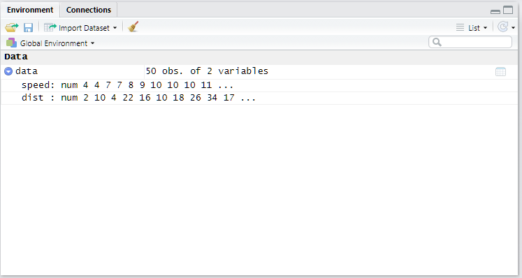
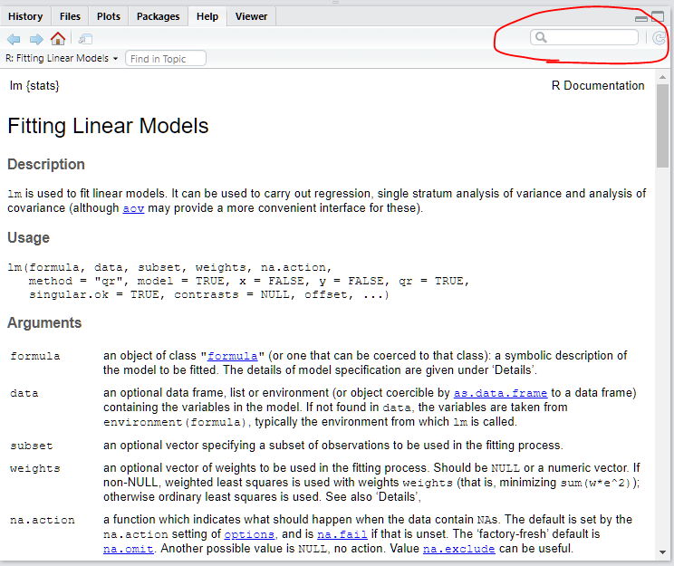

```{r setup, include=F, echo=F}
knitr::opts_chunk$set(echo = FALSE)
library(DiagrammeR)
library(knitr)
library(kableExtra)
```

## Contact

You can leave feedback on the discussion board on Toledo.

When you have questions you can send an email to:

  - <ward.fonteyn@kuleuven.be>
  - <stef.haesen@kuleuven.be>

But first try to answer your own questions through Google.

## EDCP exercises

- 2 ECTS
- Thursday 4-6 pm
- Implementation of theory seen in the previous lecture
  - 7 R-sessions
  - 2 field sessions

## Evaluation

For the exercise portion of this course, there is **permanent evaluation**.

- One task after every R-session
- Deadline: **The day before the next session at noon (12 am)**
- Late submission is **zero score** for that assignment

## R

**R** is a programming language used for data analysis and visualization. To use R effectively, we need to know about:


- Scripts
- Console
- Environment
- Objects
- Functions
- Packages

## R

We will be using **Rstudio** to communicate with R.

{#id .class width=200, height=100px}
{#id .class width=500 height=100px}


You should already have downloaded and installed **both R and Rstudio**. You need both to follow the exercises. The only program you will ever need to launch in to launch is **Rstudio**.  

## Scripts an the Console

When you open Rstudio, go to "*File - New File - R Script*" to create a new **Script**. This is your working document.
Under your script you will see the **Console**. This is your dialogue with R.

If you type something in the **Console** and press "Enter", it will be run. If you write something in your **script**, select the part you want to run and press "Ctrl" + "Enter", that part will appear in your console and will be run.

## Structure of R

- **Functions**: An action
- **Objects**: What goes in and what comes out

```{r}
DiagrammeR::grViz("
digraph dot {
graph [layout = dot, rankdir = LR]
  
node [shape = rectangle, style = filled, color = grey, fillcolor = grey]
  a1 [label = Object]
  a2 [label = Object]
  a3 [label = Object]
  c [label = Object]
  
node [shape = oval, fillcolor = orange]
  b [label = Function]
  
edge [color = grey]
a1,a2,a3 -> b -> c


  
}

")
```

## Objects

```{r, echo=T}
a <- 1
```

In R values are assigned using `<-` . A shortcut for these two symbols in Rstudio is "Alt" + "-".

`a` is now saved as an object and is assigned the value 1. If you ask R for the object `a`, it will return its value.

```{r, echo=T}
a
```

## A bigger object

```{r, echo=T, eval=F}
data <- cars
```

{height=350px}

- Click the blue arrow to expand the information.
- Click on the name to view the data.

## Data types

The building blocks for objects are:

- Character - `"Hello"`, `"a"`
- Numeric - `3.14`, `1`
- Integer - `1L`, `214L`
- Logical - (`TRUE` or `FALSE`, `T` or `F`)
- Complex - `1 + 4i`

Special values:

- `Ìnf` - Infinity
- `NA` - Not available
- `NaN` - Not a Number

## Data structures

These data types can be used on their own, or arranged in data structures:

- **Factor** (linked values, ordered or not)
- **Vector** (1D, all elements are same data type)
- **Matrix** (2D, all elements are same data type)
- **List** (1D, elements can be different data types)
- **Data frame** (2D, elements can be different data types)

## Functions

Linear regression model for the relationship between yield and spacing for apple trees:

```{r, eval=F, echo=T}
lm(yield ~ spacing, data = apples)
```

`lm()` is the function with yield, spacing and apples being the inputs.

BUT how do you know this?

## Google is your friend

- [How to do linear regression in R](https://www.google.com/search?q=How+to+do+linear+regression+in+R&rlz=1C1GCEU_nlBE892BE892&ei=D2VRYeGJO4qcgQaih6j4AQ&oq=How+to+do+linear+regression+in+R&gs_lcp=Cgdnd3Mtd2l6EAMyBAgAEEMyBQgAEIAEMgQIABAeMgYIABAIEB4yBggAEAgQHjIGCAAQCBAeMgYIABAIEB46BwgAEEcQsAM6BwgAELADEEM6BAgAEA06BggAEA0QHjoICAAQCBANEB5KBAhBGABQ13BYx3Ngu3VoAXACeACAATWIAWmSAQEymAEAoAEByAEKwAEB&sclient=gws-wiz&ved=0ahUKEwihzdviw57zAhUKTsAKHaIDCh8Q4dUDCA8&uact=5)

## "?" is your friend

Try:

```{r, echo = T, eval=F}
?lm()
```

## Using help files

{height=500px}

## Packages

The power of R lies in its packages. They are collections of functions written by other people.

```{r, echo=T, eval=F}
install.packages("dplyr")
library(dplyr)
```

You download packages to your computer using `install.packages()`. Your R session can only use the package after you load it to your library using `library()`.

```{r, echo=T, eval=F}
?dplyr
```

You can alwys use "?" to get more information on the package.

## Vignettes

Vignettes are longer form documentation and tutorials. See which are available:

```{r, echo=T, eval=F}
vignette(package = "dplyr")

```

Open the one you want using the title.

```{r, echo=T, eval=F}
vignette("dplyr", package = "dplyr")

```

## Google is your friend


- Use right terminology ("data frame" NOT "table")
- **Always** include "R" in your search
- Click some links
- Skim and see if it is what you are looking for
- Reframe your question
- Try again
- Copy and paste the answer

## Assignment

**Deadline**: Next week Wednesday at **12:00 am**

No submission is **Zero** for the assignment.

You will be graded on:

- **Correctness**: Did you end up with the same results?
- **Efficiency**: Have you kept your script short and without unnecessary actions?
- **Clarity**: Did you explain what you do in the script?

## Links

[Intro to R](https://ourcodingclub.github.io/2016/11/13/intro-to-r.html)  
[Troubleshooting](https://ourcodingclub.github.io/2016/11/15/troubleshooting.html)  
[Etiquette](https://ourcodingclub.github.io/2017/04/25/etiquette.html)  
[Data visualisation](https://ourcodingclub.github.io/2017/01/29/datavis.html)  
[Data visualisation 2](https://ourcodingclub.github.io/2017/03/29/data-vis-2.html)  
[R Style guide](http://adv-r.had.co.nz/Style.html)  


