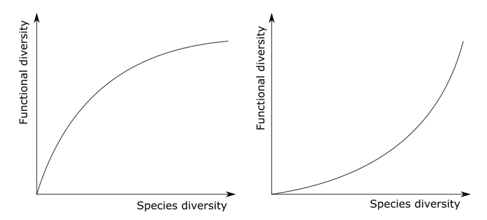

```{r setup, include=F, echo=F}
knitr::opts_chunk$set(echo = FALSE)
library(DiagrammeR)
library(knitr)
library(kableExtra)
library(FD)
library(vegan)
library(edcpR)
```

## Feedback assignment 2

- Deadline is wednesday at noon
- First step is data exploration, which includes removing outliers
- A legend should have an understandable title: "Vegetation types" instead of "Vegtype"
- `ggplot` have themes to change background and overall look
- Saving plots can be done using a function, or using the RStudio interface

## Dates

```{r, echo = T}
# Load in the data
library(edcpR)
data(vegdata_a2,  package = "edcpR")
dates <- vegdata_a2$Date
dates
```

## Dates

We have the following formats:

- "11/03/2019"
- "11.03.2019"
- "43533"

One is not like the others: Days since "1899-12-30"

A numeric date format is used due to practical reasons: a numeric value takes up less memory then a character string.

## 1899-12-30 ???

Logical would be to choose the origin a "1899-12-31". This would put "1900-01-01" as day one.

"Lotus 1-2-3", a predecessor of Excel: 1900 was a leap year

It was not, making all their day counts wrong by one day.

Microsoft noticed it was wrong, but used the format anyway and solved the problem by setting the origin at "1899-12-30".


## Numeric date formats

```{r, echo = T}
# Some numeric dates counting days from an origin
as.numeric(dates) # Only gives dates that can be converted to a number, the rest is NA
```

## as.Date function

`as.Date()` creates a special data type: Date

It can convert different formats as long as you give it the correct information:

- Character date formats
- Numeric date formats

## Numeric date formats

```{r echo=T, message=FALSE, warning=FALSE}
# Under the hood, R stores the dates as numeric values, but with origin "1970-01-01"
format_1 <- as.Date(as.numeric(dates), origin = "1899-12-30")
format_1[101:128]
```

## Character date formats 

```{r, echo = T}
# Some character dates in two formats
# see for symbols: https://devhints.io/datetime
# Only gives dates that fit format, the rest is set to NA
format_2 <- as.Date(dates, format = "%e.%m.%Y")
format_3 <- as.Date(dates, format = "%e/%m/%Y")

head(format_2)
```
## Combining

```{r, echo = T}
# Populate a new vector with all non-NA values of the three formats
conv_dates <- format_1
conv_dates[is.na(conv_dates)] <- format_2[is.na(conv_dates)]
conv_dates[is.na(conv_dates)] <- format_3[is.na(conv_dates)]
head(conv_dates) # all in the same format
```

## R uses a numeric date format

```{r, echo = T}
# Under the hood, R stores the dates as numeric values, but with origin "1970-01-01"
head(conv_dates)
head(as.numeric(conv_dates))
head(as.Date(as.numeric(conv_dates), origin = "1970-01-01"))
```

# Session 3: Diversity {data-background=https://scx2.b-cdn.net/gfx/news/hires/2020/eatorbeeaten.jpg data-background-size=cover}

## Exercises for today

- Alfa diversity
  - Calculate species richness, shannon and simpson indices
  - Calculate corresponding evenness indices
  - Calculate corresponding Hill numbers
  - Plot relationships between different alfa diversity measures
- Beta diversity
  - Calculate pairwise beta diversity
  - Partition beta diversity in nestedness and turnover components
  - Calculate multiple site beta diversity
- Gamma diversity
- Functional diversity

## Data for today

We will use data that is provided by the `vegan` package.

```{r, echo=T, eval=F}
library(vegan)
data("BCI", package = "vegan")
```

## Exercises: part 1 (20 min)

- Alfa diversity
  - Calculate species richness, shannon and simpson indices
    - **TIP**: `vegan` package
  - Calculate corresponding evenness indices
    - **TIP**: use formulas provided in the lecture slides
  - Calculate corresponding Hill numbers
    - **TIP**: `tsallis()` function
  - Plot relationships between different alfa diversity measures

## Load in data

```{r, echo=T, eval=F}
# Load in the packages which we will use
library(vegan)
```

```{r, echo=T, eval=T}
# Load data
data("BCI")
head(BCI[, c(1,2,5)])
```

## Calculate species richness (1)

```{r, echo=T, eval=T}

# Species richness
S <- specnumber(BCI)
head(S)
```

## Calculate shannon index (2)

```{r, echo=T, eval=T}

# Shannon index
H <- diversity(BCI, "shannon")
head(H)
```

## Calculate simpson index (3)

```{r, echo=T, eval=T}

# This function returns 1-D!
D <- diversity(BCI, "simpson")
head(D)
```

## Calculate simpson index (4)

```{r, echo=T, eval=T}

# This function returns 1/D
invD <- diversity(BCI, "inv")
head(invD)

```

## Calculate corresponding evenness indices (1)

```{r, echo=T, eval=T}

#Shannon evenness
J <- H/(log(S))
head(J)

```

## Calculate corresponding evenness indices (2)

```{r, echo=T, eval=T}

#Simpson evenness
E <- invD/S
head(E)

```

## Calculate corresponding Hill numbers (1)

```{r, echo=T, eval=T}

Hill <- tsallis(BCI, hill=TRUE, scales=c(0,1,2))
head(Hill)

```

## Calculate corresponding Hill numbers (2)

```{r, echo=T, eval=T}

#This should equal (see lecture formulas)
sum(Hill[, 1]) == sum(S)
sum(Hill[, 2]) == sum(exp(H))
sum(Hill[, 3]) == sum(invD) 

```

## Calculate corresponding Hill numbers (3)

```{r, echo=T, eval=T}

#Simpson diversity gives FALSE when it should be TRUE?
sum(Hill[, 3])
sum(invD)

# R somtimes holds some information back, by rounding, both are equal
round(sum(Hill[, 3]), 3) == round(sum(invD),3)
```

## Plot relationships (1)

```{r, echo=T, eval=T}

plot(S,H)

```

## Plot relationships (2)

```{r, echo=T, eval=T}

plot(S,Hill[,2])

```

## Exercises: part 2 (25 min)

- Beta diversity
  - Calculate pairwise beta diversity
    - **TIP**: `betadiver()`
  - Partition beta diversity in nestedness and turnover components
    - **TIP**: `betapart` package
    - **TIP**: tranform to presence/abscence data!
  - Calculate multiple site beta diversity
    
    
## Calculate pairwise beta diversity (1)

```{r, echo=T, eval=T}

#It is very important to first check which formula you will use
betadiver(help = TRUE)

```

## Calculate pairwise beta diversity (2)

```{r, echo=T, eval=T}

#Depending on the formula, you will get a (dis)similarity matrix!
#Notice that there also is a "sor" option (= different from the one in lectures)
sorensen <- betadiver(BCI[1:5, ], "w")
sorensen

```

## Calculate pairwise beta diversity (3)

```{r, echo=T, eval=T}

#Transform into a data frame to get a nice overview between plots
dissimilarity <- scores(sorensen)
dissimilarity
```

## Nestedness and turnover components (1)

```{r eval=T, echo=T, message=FALSE, warning=FALSE}

#Beta diversity can be partitioned in nestedness & turnover
#Both components can be calculated with the betapart package
library(betapart)

```

## Nestedness and turnover components (2)

```{r, echo=T, eval=T}

#Partitioning only works for presence/absence data
#Transform all values larger than 0 to 1
PA <- BCI
PA[PA > 0] <- 1

```

## Nestedness and turnover components (3)

```{r, echo=T, eval=T}

#First matrix is turnover (SIM)
components <- beta.pair(PA[1:5, ], index.family = "sorensen")
components$beta.sim
```

## Nestedness and turnover components (4)

```{r, echo=T, eval=T}

#Second matrix is nestedness (SNE) 
components$beta.sne

#Third matrix is the sum & should equal the previous calculation of sorensen beta diversity
components$beta.sor
```

## Calculate multiple site beta diversity (1)

```{r, echo=T, eval=T}

#Multiple site beta diversity (= one value for all sites)
#This corresponds to the differences between all sites
#Again, this is immediately partitioned in the two part (Turnover & Nestedness)
beta.multi(PA, index.family="sorensen")
```

## Exercises: part 3 (25 min)

- Gamma diversity
  - Calculate chao estimators for the BCI dataset 
    - **TIP**: `specpool()`
  - An old dataset has the following Chao estimators: Chao = 280 (SE = 11.5)  
    - Did we lose or gain species?
  
## Calculate gamma diversity

```{r, echo=T, eval=T}

#Calculate plot-based gamma diversity with chao estimators
BCI_gamma <- specpool(BCI)
BCI_gamma
```

## Calculate gamma diversity

```{r, echo=T, eval=T}

#Extract the mean and standard error
chao_BCI <- BCI_gamma$chao
chao_BCI_se <- BCI_gamma$chao.se
chao_BCI
chao_BCI_se
```

## Calculate gamma diversity

```{r, echo=T, eval=T}

#Take 100 random samples from a normal distribution!
sample_BCI <- rnorm(100, mean = chao_BCI, sd = chao_BCI_se)
head(sample_BCI)
sample <- rnorm(100, mean = 280, sd = 11.5)
head(sample)
```

## Calculate gamma diversity

```{r, echo=T, eval=T}

#Perform a t-test
t.test(sample_BCI, sample)
#p-value < 0.05 --> reject the zero-hypothesis --> significant difference!
#We lost species!
```

## Exercises: part 4 (25 min)

- Functional diversity
  - Calculate the functional diversity indices from the Tussock dataset:
    - **TIP**: `tussock` dataset from `FD` package
    - **TIP**: `dbFD()`

## Calculate functional diversity (1)

```{r, echo=T, eval=F}
#load library
library(FD)
```

## Calculate functional diversity (2)

```{r, echo=T, eval=T}
#We will make use of the Tussock dataset (= part of the package FD)
#First we need to split abundance data from trait data
traits <- tussock$trait
abundance <- tussock$abun
```

## Calculate functional diversity (3)

```{r, echo=T, eval=T}
#Now we need to clean the trait data
#We will only use continuous traits and not seedmass
#   because we are interested in the plant itself
#We also need to remove species on which we have no trait data
traits <- traits[, c(2:7, 11)] 
traits <- na.omit(traits)
head(traits)
```

## Calculate functional diversity (4)

```{r, echo=T, eval=T}
#Only select the species that do have traits!
#We omitted two, so here those two should also be deleted
abundance <- abundance[, rownames(traits)] 
```

## Calculate functional diversity (5)

```{r, echo=T, eval=T}
#Calculate species richness
#Transform abundance to a data frame
spec_richness <- rowSums(abundance != 0)
abundance <- as.data.frame(abundance)
```

## Calculate functional diversity (6)

```{r, echo=T, eval=T}
# Calculate all FD indices
FD <- dbFD(traits, abundance)
# You wil see FD is a list containing different functional diversity indices
# Functional richness, functional eveness, functional divergence...
```

## Calculate functional diversity (7)

```{r, echo=T, eval=T}
# Plot FD vs species diversity
plot(spec_richness, FD$FRic)
```

## Conclusion?



## Assignment 3

Access the assignment:

```{r, echo=T, eval=F}
vignette("assignment-3", package = "edcpR")
```

Remember to upload everything before **November 3rd, 12 am (= at noon!)**.
